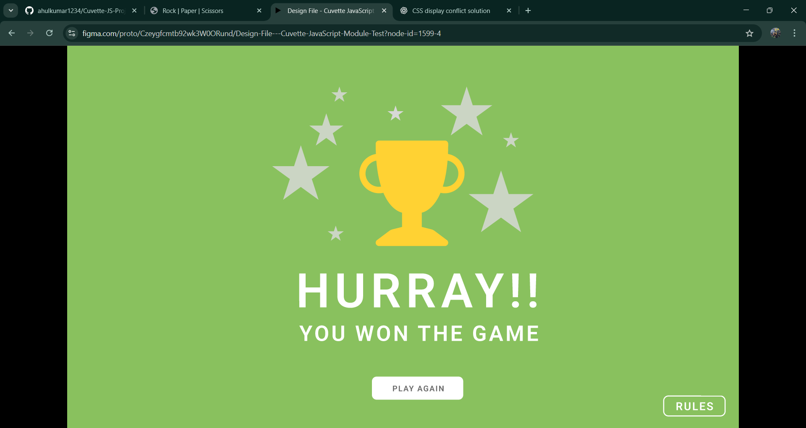

# 🎮 Rock Paper Scissors Game (Cuvette JS Project)

This is a **Rock Paper Scissors** game built using **HTML, CSS, and Vanilla JavaScript** as part of the **Cuvette JavaScript Module Project**.

The game follows a **single-page application logic** where screens are shown/hidden dynamically using JavaScript and CSS classes.

---

## 🚀 Live Demo

- **GitHub Pages:**  
  👉 https://ahulkumar1234.github.io/Cuvette-JS-Project/index.html

---
## 📸 Screenshots

### 🏠 Game Screen


### 🏆 Result Screen


### 🎉 Hurray Screen



---

## 🛠️ Tech Stack

- **HTML5** – Structure  
- **CSS3** – Styling & animations  
- **JavaScript (Vanilla JS)** – Game logic & DOM manipulation  

---

## 🎯 Features

- 🎲 Random computer choice generation  
- 🧠 Game result logic (Win / Lose / Tie)  
- 🟢 Winner glow animation  
- 👉 **Next button appears only when user wins**  
- 🎉 Hurray screen shown on winning  
- 🔄 Play Again functionality  
- 📱 Responsive & clean UI  

---

## 🕹️ How the Game Works

1. User selects **Rock / Paper / Scissors**
2. Computer randomly selects its choice
3. Result is calculated:
   - User Win
   - Computer Win
   - Tie
4. Result screen is displayed with choices
5. If user wins → **Next button appears**
6. Clicking Next → **Hurray screen**
7. Play Again resets the game

---

## 📂 Project Structure

```
Cuvette-JS-Project/
│── index.html
│── css/
  |--game.css
  |--hurray.css
  |--main.css
  |--result.css
│── js/
  |--ui.js
│── public/
│ ├── stone.png
│ ├── paper.png
│ └── scissor.png

```

---

## ⚙️ Game Logic (Summary)

- Computer choice generated using `Math.random()`
- Screens controlled using `classList.add()` and `classList.remove()`
- Images updated dynamically using JavaScript
- Animations handled using CSS keyframes

---

## 📌 Key Learnings

- DOM manipulation using Vanilla JavaScript  
- Conditional rendering using CSS classes  
- Single-page application flow without frameworks  
- Debugging display & positioning issues  
- Deployment using GitHub Pages  

---

## 👨‍💻 Author

**Rahul Kumar**  
- GitHub: https://github.com/ahulkumar1234  
- LinkedIn: https://www.linkedin.com/in/rahul-kumar-3990b618b  

---

## 📜 License

This project is created for **learning and academic purposes** under the Cuvette curriculum.

---

### ⭐ If you like this project, don’t forget to give it a star!
